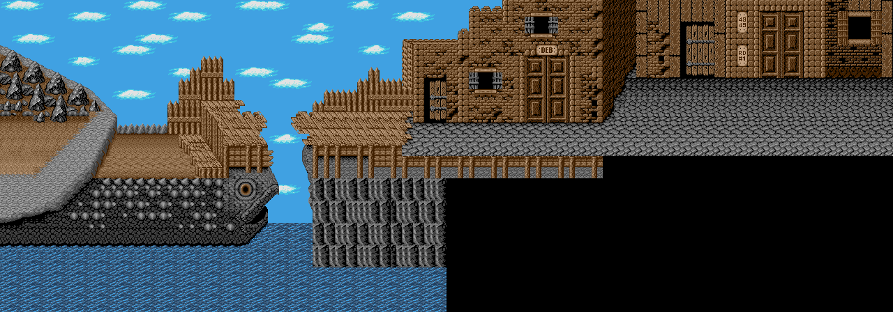

# Golden Axe Explorer

Parser/extractor for the graphic files from the PC version of the Golden Axe game https://en.wikipedia.org/wiki/Golden_Axe

It was lying on my hard drive for almost 2 years now and I didn't really moved forward with writing a proper blog post. I figured I will just put the sources on GitHub. The explorer UI is very similar to the one I wrote for the Mortal Kombat.

Required python libraries:
- Pillow
- Kaitai Struct

Running:
```
pip install pillow
pip install kaitaistruct
python tkgui.py
```

Supported file formats:
- SPR - sprites 
- CHR - tiles for the MAP files 
- MAP - levels 

MAP file format has a few more bits and pieces that I never finished (like markers for the walkable areas etc).